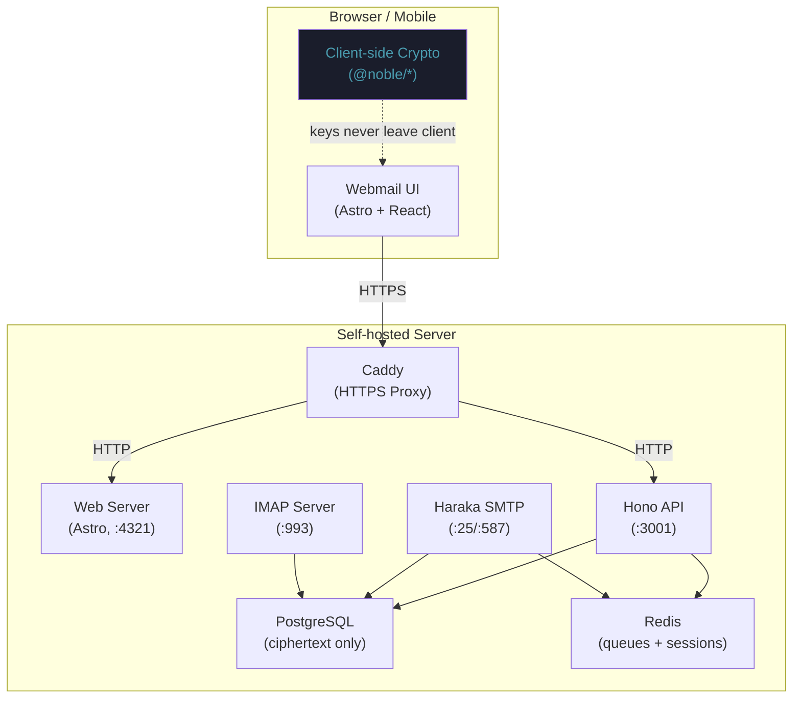

# Enclave Mail

[](https://bun.sh)
[](LICENSE)
[](https://github.com/hffmnnj/enclave-mail/releases)

**Self-hosted, end-to-end encrypted email with Proton Mail-level security — user-controlled keys and infrastructure.**

Enclave Mail is a complete email server and webmail client you run on your own VPS. The server stores only ciphertext and never sees your plaintext messages or passwords. Your private keys are generated in the browser and never leave your device.

---

## Architecture



> 🔒 **Zero-knowledge design**: The server stores only encrypted ciphertext. Your private keys and message content never leave your device.

---

## Prerequisites

### Server requirements

| Resource | Minimum |
|----------|---------|
| CPU | 2 vCPU |
| RAM | 2 GB |
| OS | Ubuntu 22.04+ (or any Linux with Docker) |
| Storage | 20 GB+ (depends on mail volume) |

### Open ports

| Port | Protocol | Purpose |
|------|----------|---------|
| 25 | TCP | SMTP inbound (MX delivery from other servers) |
| 587 | TCP | SMTP submission (authenticated clients) |
| 993 | TCP | IMAPS (TLS-wrapped IMAP) |
| 80 | TCP | HTTP (redirected to HTTPS by Caddy) |
| 443 | TCP | HTTPS (webmail + API) |

### Other requirements

- A domain name with DNS access (e.g. `example.com`)
- [Docker](https://docs.docker.com/engine/install/) + [Docker Compose v2](https://docs.docker.com/compose/install/)
- **Optional:** [Tailscale](https://tailscale.com) account for private-network deployments

---

## Quick Start

```bash
# 1. Clone and configure
git clone https://github.com/hffmnnj/enclave-mail.git
cd enclave-mail
cp .env.example .env

# 2. Edit .env — set DOMAIN, SMTP_DOMAIN, POSTGRES_PASSWORD, REDIS_PASSWORD
nano .env

# 3. Generate DKIM key pair (outputs DNS record to copy)
SMTP_DOMAIN=your-domain.com bun run scripts/generate-dkim-keys.ts

# 4. Start all services
docker compose up -d

# 5. Run database migrations
docker compose exec server bun run src/db/migrate.ts

# 6. Open webmail and complete onboarding
open https://your-domain.com
```

> **Note:** Caddy automatically provisions a TLS certificate via Let's Encrypt on first startup. Ensure ports 80 and 443 are reachable before starting.

---

## DNS Configuration

Configure the following DNS records at your domain registrar or DNS provider. Replace `YOUR_SERVER_IP` and `your-domain.com` with your actual values.

```
# MX record — tells other mail servers where to deliver your mail
Type:     MX
Name:     @  (or your-domain.com)
Value:    mail.your-domain.com
Priority: 10
TTL:      3600

# A record — resolves the mail subdomain to your server
Type:  A
Name:  mail
Value: YOUR_SERVER_IP
TTL:   3600

# SPF record — authorises your server to send mail for your domain
Type:  TXT
Name:  @
Value: v=spf1 ip4:YOUR_SERVER_IP -all
TTL:   3600

# DKIM record — cryptographic signature for outbound mail
# Get the selector and value from the generate-dkim-keys.ts output
Type:  TXT
Name:  mail._domainkey
Value: v=DKIM1; k=rsa; p=<YOUR_DKIM_PUBLIC_KEY>
TTL:   3600

# DMARC record — policy for handling unauthenticated mail
Type:  TXT
Name:  _dmarc
Value: v=DMARC1; p=quarantine; rua=mailto:admin@your-domain.com
TTL:   3600
```

> **Propagation:** DNS changes can take up to 48 hours to propagate globally, though most providers update within minutes.

### Verify DNS

Use the included verification script to check all records are configured correctly:

```bash
# Run DNS verification
bun run scripts/verify-dns.ts your-domain.com YOUR_SERVER_IP

# Or check manually with dig
dig MX your-domain.com
dig TXT your-domain.com | grep spf
dig TXT mail._domainkey.your-domain.com
dig TXT _dmarc.your-domain.com
```

---

## Initial Account Setup

1. Navigate to `https://your-domain.com`
2. Click **Create Account** — this launches the onboarding wizard
3. **Step 1:** Enter your email address and choose a strong passphrase
4. **Step 2:** Keys are generated client-side using Argon2id + X25519/Ed25519 — this may take a few seconds
5. **Step 3:** **Export your keys** — download `enclave-keys.json` and store it securely
6. **Step 4:** Confirm the export — your account is now active

> ⚠️ **Critical:** Your `enclave-keys.json` file is the only way to decrypt your messages. There is **no recovery mechanism** — if you lose your keys, your encrypted mail is permanently inaccessible. Store the backup in a password manager or offline secure location.

---

## IMAP Client Setup

Enclave Mail exposes a standard IMAP4rev1 server for use with desktop clients. Note that messages fetched via IMAP are delivered as ciphertext — use the webmail for the best experience with automatic decryption.

### Thunderbird (or any IMAP client)

**Incoming mail (IMAP):**

| Setting | Value |
|---------|-------|
| Protocol | IMAP |
| Server | `your-domain.com` |
| Port | `993` |
| Connection security | SSL/TLS |
| Authentication | Normal password (session token) |
| Username | `your@your-domain.com` |

**Outgoing mail (SMTP):**

| Setting | Value |
|---------|-------|
| Server | `your-domain.com` |
| Port | `587` |
| Connection security | STARTTLS |
| Authentication | Normal password |
| Username | `your@your-domain.com` |

---

## IP Warmup

When sending from a new IP address, major mail providers (Gmail, Outlook, etc.) apply strict filtering until your IP establishes a sending reputation. Follow this warmup schedule:

| Week | Daily send limit |
|------|-----------------|
| 1 | < 50 messages |
| 2 | < 200 messages |
| 3–4 | < 1,000 messages |
| 5–6 | Gradually increase |

**Best practices:**

1. Monitor bounce rates — keep below 2%
2. Check delivery logs: `docker compose logs server`
3. Use [MXToolbox](https://mxtoolbox.com/SuperTool.aspx) to check blacklists and DNS health
4. Use [mail-tester.com](https://www.mail-tester.com) to score your outbound mail configuration
5. Ensure SPF, DKIM, and DMARC are all passing before increasing volume

---

## Tailscale Setup

For private-network deployments where the server is not publicly accessible, Enclave Mail supports Tailscale for secure overlay networking. See [docs/tailscale-setup.md](docs/tailscale-setup.md) for the full guide.

---

## Development

### Prerequisites

- [Bun](https://bun.sh) v1.3.5+
- PostgreSQL 16 and Redis 7 — via Docker **or** installed locally (see options below)

---

### Option A — Docker Compose (recommended)

Requires [Docker Engine](https://docs.docker.com/engine/install/) + [Docker Compose v2](https://docs.docker.com/compose/install/).

```bash
# 1. Install dependencies
bun install

# 2. Copy environment file
cp .env.example .env

# 3. Generate dev TLS cert and DKIM key
bash scripts/gen-certs.sh
bash scripts/gen-dkim.sh

# 4. Start PostgreSQL + Redis (schema applied automatically on first start)
docker compose -f docker-compose.dev.yml up -d

# 5. Start the app (two terminals)
bun run --cwd apps/server dev   # API + SMTP + IMAP  →  http://localhost:3001
bun run --cwd apps/web dev      # Webmail            →  http://localhost:4321
```

Open **http://localhost:4321/onboarding** to create your first account.

> SMTP binds to 2025/2587 and IMAP to 1993 by default (no root required). These are set in `.env` and `apps/server/haraka/config/smtp.ini`.

---

### Option B — Manual setup (no Docker)

Install PostgreSQL 16 and Redis 7 via your OS package manager, apply the schema, then run the app.

**Ubuntu / Debian**
```bash
sudo apt install -y postgresql-16 redis-server
sudo systemctl start postgresql redis-server
sudo -u postgres createuser --superuser $USER
createdb enclave
psql enclave < packages/db/src/setup.sql
```

**macOS (Homebrew)**
```bash
brew install postgresql@16 redis
brew services start postgresql@16 redis
createdb enclave
psql enclave < packages/db/src/setup.sql
```

**Arch Linux**
```bash
sudo pacman -S postgresql redis
sudo -u postgres initdb -D /var/lib/postgres/data
sudo systemctl start postgresql redis
createdb enclave
psql enclave < packages/db/src/setup.sql
```

Then:

```bash
cp .env.example .env          # edit DATABASE_URL if your Postgres user/port differs
bash scripts/gen-certs.sh
bash scripts/gen-dkim.sh
bun install

# Two terminals:
bun run --cwd apps/server dev
bun run --cwd apps/web dev
```

---

### Common commands

```bash
bun run typecheck   # Type-check all packages
bun test            # Run all tests
bun run lint        # Lint with Biome
bun run format      # Format with Biome
```

### Monorepo structure

| Package | Description |
|---------|-------------|
| `apps/server` | Mail daemon — Hono API, Haraka SMTP, IMAP4rev1 server |
| `apps/web` | Astro SSR webmail with React islands |
| `@enclave/db` | Drizzle ORM schema + migrations |
| `@enclave/crypto` | E2E encryption primitives (@noble/*) |
| `@enclave/types` | Shared TypeScript types |
| `@enclave/ui` | Shadcn/ui component library |

### Security model

| Property | Detail |
|----------|--------|
| Authentication | SRP (Secure Remote Password) — server never receives plaintext passwords |
| Message encryption | Double Ratchet + X3DH session encryption |
| Key derivation | Argon2id (64 MiB memory, 3 iterations) |
| Asymmetric keys | X25519 (key exchange) + Ed25519 (signing) |
| Symmetric cipher | ChaCha20-Poly1305 |
| Storage | Server stores ciphertext only — zero plaintext at rest |

---

## License

MIT © 2026 — v0.1.0
